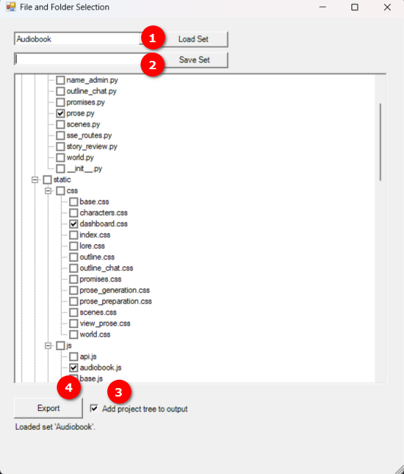
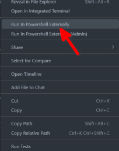

# PowerShell Codebase Exporter

A PowerShell script with a graphical user interface (GUI) designed to select files and folders from a project and combine them into a single text file. Its primary purpose is to create a selective, well-formatted codebase export, ideal for providing focused context to AI assistants without flooding their context windows.

## Features

-   Graphical file and folder selection via a tree view.
-   Save and load common file selections as "File Sets".
-   Automatic exclusion of files and folders listed in the project's `.gitignore` file.
-   A configurable list for manual exclusions directly within the script.
-   Optionally prepends a project structure tree to the output file.
-   Combines selected files into a single, clearly delimited text file.

## Setup

Place the `ExportCodebase.ps1` script into the root directory of the project you wish to export files from. I usually name it `zExportCodebase.ps1` so that I can always find it at the bottom of my file list in VS Code. 

## How to Use

1.  Run the `ExportCodebase.ps1` script.
2.  The GUI will appear, displaying your project's file tree.
3.  Check the boxes next to the files and folders you want to include in the export.
4.  Optionally, save your current selection as a "File Set" for future use.
5.  Choose whether to include the project tree in the output.
6.  Click the "Export" button and choose a location to save the combined `.txt` file.

## UI Overview



1.  **Load File Set**: Select a previously saved set from this dropdown menu and click the "Load Set" button. The tree view will automatically check all the files associated with that set.
2.  **Save File Set**: After checking the desired files in the tree, enter a name in the text field and click the "Save Set" button. This selection will be saved into `file-sets.txt` for later use.
3.  **Add project tree to output**: If checked, a text-based representation of your project's complete file and folder structure (respecting all exclusions) will be added to the top of the exported file. This tree of the project really seems helpful to the AI. 
4.  **Export**: After selecting your files, click this button to open a save dialog. The script will then generate a single `.txt` file containing the contents of all selected files. Each file's content is preceded by a divider and its relative path. For AI Studio I open the exported file, select all, copy and paste into chat. For OpenWebUI and OpenRouter I drop in the new text file. 

## File Descriptions

-   **`ExportCodebase.ps1`**: The main executable PowerShell script.
-   **`file-sets.txt`**: A plain text file created by ExportCodebase.ps1 if you save a file set. It stores saved file sets. 


## Running the Script

The script can be run from any PowerShell terminal. Navigate to your project's root directory and execute the script:

```powershell
.\ExportCodebase.ps1
```

Alternatively, I use the [Run in Powershell](https://marketplace.visualstudio.com/items?itemName=tobysmith568.run-in-powershell) extension in VS Code by right clicking on the script and running externally. 



### Customization

You can manually add folder or file names to a base exclusion list. This is useful for project-specific tooling or build directories that aren't in `.gitignore`.

To do this, open `ExportCodebase.ps1` and add the desired folder/file names to the `$baseExclude` array near the top of the file.